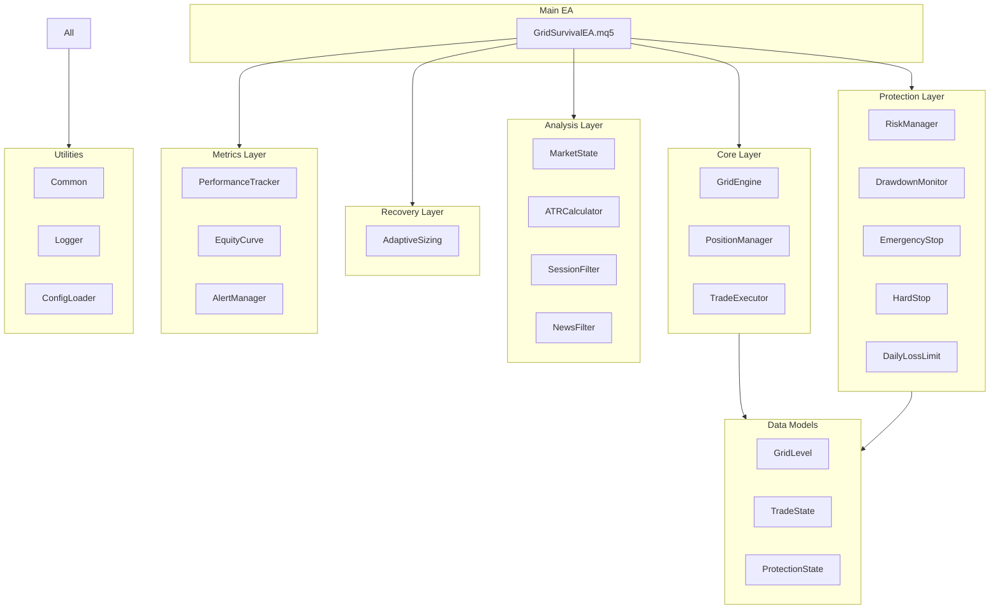
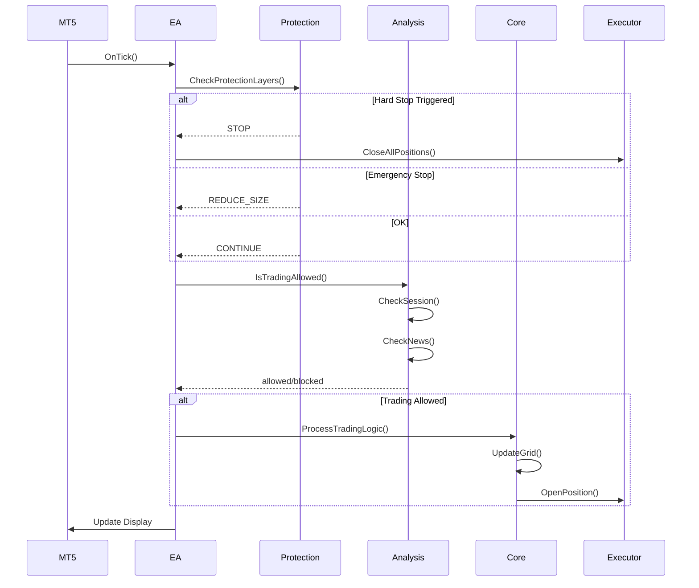

# Architecture Overview

## System Design

The Grid Survival Protocol EA follows a **modular, layered architecture** designed for:

- **Testability**: Each module can be tested independently
- **Maintainability**: Clear separation of concerns
- **Extensibility**: Easy to add new features
- **Safety**: Multiple protection layers

## Component Diagram



## Data Flow



## Protection Priority Order

```
┌─────────────────────────────────────────────────────┐
│                   HARD STOP (20%)                   │
│             Closes all, locks EA                    │
├─────────────────────────────────────────────────────┤
│                 DAILY LIMIT (5%)                    │
│            Stops trading until reset                │
├─────────────────────────────────────────────────────┤
│               EMERGENCY STOP (10%)                  │
│          Reduces size, blocks new trades            │
├─────────────────────────────────────────────────────┤
│                SESSION FILTER                       │
│             Blocks outside hours                    │
├─────────────────────────────────────────────────────┤
│                  NEWS FILTER                        │
│            Pauses around events                     │
├─────────────────────────────────────────────────────┤
│                 SPREAD CHECK                        │
│            Blocks high spread                       │
├─────────────────────────────────────────────────────┤
│              NORMAL TRADING                         │
│           Grid logic executes                       │
└─────────────────────────────────────────────────────┘
```

## Module Responsibilities

### Core Layer

| Module | Responsibility |
|--------|----------------|
| `GridEngine` | Calculate grid levels, manage spacing |
| `PositionManager` | Track open positions, calculate exposure |
| `TradeExecutor` | Execute orders with retry logic |

### Protection Layer

| Module | Responsibility |
|--------|----------------|
| `RiskManager` | Calculate lot sizes, check risk limits |
| `DrawdownMonitor` | Track real-time drawdown |
| `EmergencyStop` | Level 1: Reduce exposure |
| `HardStop` | Level 2: Close all, lock EA |
| `DailyLossLimit` | Daily loss tracking and limits |

### Analysis Layer

| Module | Responsibility |
|--------|----------------|
| `MarketState` | Detect trending/ranging conditions |
| `ATRCalculator` | Calculate volatility-based spacing |
| `SessionFilter` | Time-based trading filter |
| `NewsFilter` | High-impact news pause |

### Recovery Layer

| Module | Responsibility |
|--------|----------------|
| `AdaptiveSizing` | Adjust lot size based on DD |

### Metrics Layer

| Module | Responsibility |
|--------|----------------|
| `PerformanceTracker` | Win rate, profit factor, etc. |
| `EquityCurve` | Equity history and analysis |
| `AlertManager` | Notifications and alerts |

## State Management

### EA States

```
INITIALIZING → IDLE ↔ TRADING
                 ↓       ↓
              PAUSED ← EMERGENCY → SHUTDOWN
```

### Trading Modes

```
NORMAL → REDUCED → CLOSE_ONLY → DISABLED
```

## Thread Safety

MQL5 is single-threaded, but the architecture is designed to:

1. Minimize expensive operations in `OnTick()`
2. Cache indicator values appropriately
3. Use efficient data structures

## Error Handling

Each module implements:

1. **Initialization validation**: Check prerequisites
2. **Runtime error catching**: Handle trade failures
3. **State recovery**: Resume after errors
4. **Logging**: All errors are logged

## Memory Management

- Fixed-size arrays where possible
- Ring buffers for equity history
- Cleanup in `OnDeinit()`

---

*Architecture designed for resilience and maintainability.*
